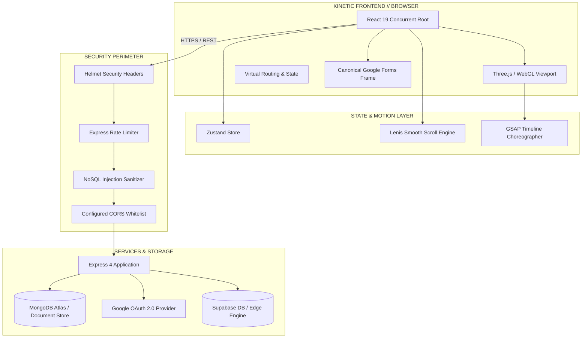

<div align="center">

<!-- EMBEDDED CYBERPUNK / SWISS EDITORIAL SVG HEADER -->
<p align="center">
  
</p>


<br/>

<!-- DYNAMIC TYPING SVG SERVICE -->
<a href="https://github.com/Demmonics/stuco_website">
  
</a>

<br/>

<!-- HIGH-IMPACT STATUS & TECH BADGES -->
<p align="center">
  <a href="#-tech-stack-matrix"></a>
  <a href="#-tech-stack-matrix"></a>
  <a href="#-tech-stack-matrix"></a>
  <a href="#-tech-stack-matrix"></a>
  <a href="#-tech-stack-matrix"></a>
  <a href="#-tech-stack-matrix"></a>
  <a href="#-architecture--runtime-workflow"></a>
</p>

</div>

---

### ◈ THE ARCHITECTURAL MANIFESTO

> *"An avant-garde convergence of kinetic 3D WebGL computing, cyber-brutalist typography, and enterprise-grade event orchestrations built for **K. J. Somaiya College of Engineering (KJSSE)**."*

**Abhiyantriki** serves as the central digital spine for Maharashtra's premier engineering festival. Engineered with uncompromising attention to Swiss editorial precision, hyper-fluid 60 FPS motion dynamics, and hardened enterprise middleware, this platform unifies student governance, technical competitions, keynote summits, and live engagement into a cohesive, immersive web application.

---

### ❖ CORE CAPABILITIES

```
┌───────────────────────────┬───────────────────────────┬───────────────────────────┐
│ 01 // KINETIC 3D CANVAS   │ 02 // EVENT ENGINE        │ 03 // INSTITUTIONAL CORE  │
├───────────────────────────┼───────────────────────────┼───────────────────────────┤
│ • @react-three/fiber      │ • Multi-tier event filter │ • Student council rosters │
│ • GLTF/GLB models         │ • Dynamic search index    │ • Departmental committees │
│ • Smooth camera lerping   │ • Embedded Google Forms   │ • Direct secretariat desk │
│ • Lenis smooth scrolling  │ • Fallback external tab   │ • Zero-lag reactive UI    │
└───────────────────────────┴───────────────────────────┴───────────────────────────┘
```

- **Kinetic Three.js & GLTF Model Engine**: Seamless ambient 3D viewports featuring responsive camera projection, lighting calculations, particle dust fields, and real-time interaction states.
- **Enterprise-Grade Event Command Center**: Comprehensive directory with instant categorical filtering (`All`, `Flagship`, `Hackathons`, `Robotics`, `Competitions`, `Workshops`), real-time modal previews, and canonical Google Form iframe integration.
- **Micro-Interaction & Motion Design**: Custom GPU-accelerated specular button shaders, true-focus chromatic text splitters, and Lenis virtual scroll interpolation.
- **Hardened Perimeter Defense**: Complete security middleware suite with `helmet` CSP headers, MongoDB injection sanitization (`express-mongo-sanitize`), rate limiting, parameter pollution guards (`hpp`), and Google OAuth 2.0 integration.

---

### ⚡ TECH STACK MATRIX

| Layer | Technologies & Ecosystem |
| :--- | :--- |
| **Frontend Framework** | `React 19.2` · `TypeScript 6.0` · `Vite 8.3` · `Zustand 5.0` · `TanStack Query 5` |
| **Graphics & Motion** | `Three.js 0.186` · `@react-three/fiber 9.7` · `@react-three/drei 10.7` · `GSAP 3.15` · `Lenis 1.3` |
| **Styling & Design System** | `Tailwind CSS 3.4` · Custom Glassmorphism · Cyberpunk Shaders · Swiss Grid System |
| **Backend & Ingestion** | `Node.js 24 LTS` · `Express 4.21` · `Mongoose 8.12` · `@supabase/supabase-js 2.116` |
| **Security & Auditing** | `Helmet 8.0` · `Express Rate Limit 7.5` · `Express Mongo Sanitize` · `Zod 4.6` · `Oxlint` |

---

### ⚙ ARCHITECTURE & RUNTIME WORKFLOW



---

### 📁 REPOSITORY BLUEPRINT

```ascii
abhiyantriki/
├── public/
│   ├── models/                  # Interactive 3D assets (GLTF / GLB scenes)
│   ├── Council/                 # Somaiya Student Council heritage assets
│   └── favicon.ico              # Institutional brand icon
├── src/
│   ├── components/
│   │   ├── events/              # Event Directory, Modal, Registration Engine
│   │   ├── forms/               # Embedded Google Forms with external tab failover
│   │   ├── hero/                # Cyberpunk Hero viewport with glowing typographic split
│   │   ├── reactbits/           # Custom hardware-accelerated shaders (Specular, TrueFocus)
│   │   ├── sections/            # About, Flagships, Council Secretariat, Showcases
│   │   └── three/               # Persistent WebGL canvas & 3D space scene
│   ├── lib/                     # Supabase & client configurations
│   ├── types/                   # Strict TypeScript contracts & domain models
│   ├── App.tsx                  # Root orchestration & dynamic scene state switching
│   └── main.tsx                 # React concurrent root entrypoint
├── server/                      # Hardened Express API & middleware stack
├── server.js                    # Production entrypoint & static proxy
└── vite.config.ts               # Ultra-fast bundler configuration
```

---

### 🚀 QUICKSTART & LOCAL PROVISIONING

#### 1. Clone & Access
```bash
git clone https://github.com/Demmonics/stuco_website.git
cd stuco_website/abhiyantriki
```

#### 2. Install Dependencies
```bash
npm install
```

#### 3. Configure Environment
Create a `.env` file in `abhiyantriki/`:
```env
PORT=5000
NODE_ENV=development
VITE_GOOGLE_CLIENT_ID=your_google_oauth_client_id.apps.googleusercontent.com
VITE_SUPABASE_URL=https://your-project.supabase.co
VITE_SUPABASE_ANON_KEY=your_supabase_anon_key
```

#### 4. Launch Development Server
```bash
npm run dev
```
Navigate to `http://localhost:5173` to experience the 3D kinetic workspace.

#### 5. Build for Production
```bash
npm run build
npm start
```

---

### 📊 TELEMETRY & REPOSITORY INSIGHTS

<div align="center">
  <table border="0">
    <tr>
      <td align="center">
        
      </td>
      <td align="center">
        
      </td>
    </tr>
  </table>
</div>

---

### 🏛 CREATIVE DIRECTION & CREDITS

<div align="center">

```
Designed & Engineered with Swiss Modernism & Cyber-Brutalist aesthetics.
```

**Creative Lead & Fullstack Architect:** **Yoosha Abbas** ([@Demmonics](https://github.com/Demmonics))  
**Governing Body:** **K.J. Somaiya College of Engineering Student Council**  
**Official Secretariat Inquiries:** `secretary.council.engg@somaiya.edu`

<p align="center">
  
</p>

</div>
