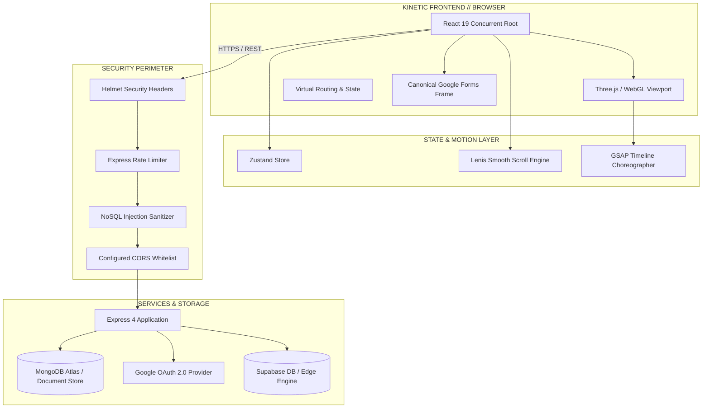

<div align="center">

<!-- EMBEDDED CYBERPUNK / SWISS EDITORIAL SVG HEADER -->
<svg xmlns="http://www.w3.org/2000/svg" viewBox="0 0 1200 380" width="100%" height="auto">
  <defs>
    <!-- Background Gradient -->
    <linearGradient id="bgGrad" x1="0%" y1="0%" x2="100%" y2="100%">
      <stop offset="0%" stop-color="#05070c"/>
      <stop offset="50%" stop-color="#080c16"/>
      <stop offset="100%" stop-color="#020306"/>
    </linearGradient>

    <!-- Glowing Text Gradient -->
    <linearGradient id="glowCyan" x1="0%" y1="0%" x2="100%" y2="0%">
      <stop offset="0%" stop-color="#00f0ff"/>
      <stop offset="50%" stop-color="#7000ff"/>
      <stop offset="100%" stop-color="#ff007f"/>
    </linearGradient>

    <!-- Accent Border Gradient -->
    <linearGradient id="borderGrad" x1="0%" y1="0%" x2="100%" y2="100%">
      <stop offset="0%" stop-color="#00f0ff" stop-opacity="0.8"/>
      <stop offset="30%" stop-color="#7000ff" stop-opacity="0.2"/>
      <stop offset="70%" stop-color="#ffffff" stop-opacity="0.1"/>
      <stop offset="100%" stop-color="#ff007f" stop-opacity="0.7"/>
    </linearGradient>

    <!-- Glow Filter -->
    <filter id="neonFilter" x="-20%" y="-20%" width="140%" height="140%">
      <feGaussianBlur stdDeviation="6" result="blur1"/>
      <feGaussianBlur stdDeviation="15" result="blur2"/>
      <feMerge>
        <feMergeNode in="blur2"/>
        <feMergeNode in="blur1"/>
        <feMergeNode in="SourceGraphic"/>
      </feMerge>
    </filter>

    <!-- Subtle Scanline Pattern -->
    <pattern id="scanlines" width="100" height="4" patternUnits="userSpaceOnUse">
      <line x1="0" y1="0" x2="100" y2="0" stroke="#00f0ff" stroke-opacity="0.04" stroke-width="1"/>
    </pattern>

    <!-- Grid Pattern -->
    <pattern id="swissGrid" width="40" height="40" patternUnits="userSpaceOnUse">
      <path d="M 40 0 L 0 0 0 40" fill="none" stroke="#ffffff" stroke-opacity="0.03" stroke-width="1"/>
      <circle cx="40" cy="40" r="1" fill="#00f0ff" fill-opacity="0.15"/>
    </pattern>

    <style>
      @keyframes pulseGlow {
        0%, 100% { opacity: 0.85; filter: drop-shadow(0 0 12px rgba(0, 240, 255, 0.4)); }
        50% { opacity: 1; filter: drop-shadow(0 0 25px rgba(255, 0, 127, 0.6)); }
      }
      @keyframes radarSweep {
        0% { transform: rotate(0deg); }
        100% { transform: rotate(360deg); }
      }
      @keyframes scanShift {
        0% { transform: translateY(0); }
        100% { transform: translateY(20px); }
      }
      @keyframes blinkCursor {
        0%, 49% { opacity: 1; }
        50%, 100% { opacity: 0; }
      }
      .title-text {
        font-family: 'Space Grotesk', 'Inter', -apple-system, BlinkMacSystemFont, 'Segoe UI', sans-serif;
        font-weight: 900;
        letter-spacing: 0.18em;
        text-transform: uppercase;
        animation: pulseGlow 5s ease-in-out infinite;
      }
      .sub-title {
        font-family: 'JetBrains Mono', 'Space Mono', 'Consolas', monospace;
        font-weight: 500;
        letter-spacing: 0.35em;
      }
      .tech-tag {
        font-family: 'JetBrains Mono', monospace;
        font-size: 11px;
        fill: #8e9bb0;
        letter-spacing: 0.12em;
      }
      .cursor {
        animation: blinkCursor 1s infinite;
      }
    </style>
  </defs>

  <!-- Background Base -->
  <rect width="1200" height="380" rx="16" fill="url(#bgGrad)"/>
  <rect width="1200" height="380" rx="16" fill="url(#swissGrid)"/>
  <rect width="1200" height="380" rx="16" fill="url(#scanlines)"/>

  <!-- Border Perimeter -->
  <rect x="10" y="10" width="1180" height="360" rx="12" fill="none" stroke="url(#borderGrad)" stroke-width="1.5"/>

  <!-- Swiss Crosshairs & Coordinate Targets -->
  <!-- Top Left -->
  <path d="M 30 50 L 50 50 M 40 40 L 40 60" stroke="#00f0ff" stroke-width="1.5" opacity="0.6"/>
  <text x="60" y="54" class="tech-tag" fill="#00f0ff" opacity="0.8">[ SYS.LOC // 19.0760° N, 72.8777° E ]</text>

  <!-- Top Right -->
  <path d="M 1150 50 L 1170 50 M 1160 40 L 1160 60" stroke="#00f0ff" stroke-width="1.5" opacity="0.6"/>
  <text x="960" y="54" class="tech-tag" fill="#ff007f" opacity="0.8">STUCO_CORE // v3.4.0-PROD</text>

  <!-- Bottom Coordinates -->
  <path d="M 30 330 L 50 330 M 40 320 L 40 340" stroke="#7000ff" stroke-width="1.5" opacity="0.5"/>
  <text x="60" y="334" class="tech-tag">ARCH: REACT 19 // R3F // LENIS // NODE</text>

  <path d="M 1150 330 L 1170 330 M 1160 320 L 1160 340" stroke="#7000ff" stroke-width="1.5" opacity="0.5"/>
  <text x="930" y="334" class="tech-tag">SECURITY: HELMET // RBAC // OAUTH</text>

  <!-- Corner Accents -->
  <rect x="18" y="18" width="8" height="8" fill="#00f0ff" opacity="0.9"/>
  <rect x="1174" y="18" width="8" height="8" fill="#ff007f" opacity="0.9"/>
  <rect x="18" y="354" width="8" height="8" fill="#7000ff" opacity="0.9"/>
  <rect x="1174" y="354" width="8" height="8" fill="#00f0ff" opacity="0.9"/>

  <!-- Center Aesthetic Badge -->
  <rect x="470" y="40" width="260" height="28" rx="14" fill="#000000" stroke="#00f0ff" stroke-width="1" stroke-dasharray="4 2" opacity="0.75"/>
  <circle cx="486" cy="54" r="4" fill="#00f0ff">
    <animate attributeName="opacity" values="1;0.2;1" dur="2s" repeatCount="indefinite"/>
  </circle>
  <text x="502" y="58" class="tech-tag" fill="#ffffff" font-weight="bold">K.J. SOMAIYA TECHFEST</text>

  <!-- Main Hero Headline -->
  <g transform="translate(600, 175)">
    <text x="0" y="0" text-anchor="middle" font-size="62" fill="url(#glowCyan)" class="title-text" filter="url(#neonFilter)">
      ABHIYANTRIKI
    </text>
    <text x="0" y="0" text-anchor="middle" font-size="62" fill="#ffffff" class="title-text" opacity="0.95">
      ABHIYANTRIKI
    </text>
  </g>

  <!-- Subtitle / Mission Statement -->
  <g transform="translate(600, 225)">
    <text x="0" y="0" text-anchor="middle" font-size="14" fill="#a4b3c6" class="sub-title">
      STUDENT COUNCIL OFFICIAL PLATFORM &amp; TECHNICAL FEST ENGINE
    </text>
  </g>

  <!-- Decorative Status Gauge / Soundwave Bar -->
  <g transform="translate(425, 260)">
    <rect x="0" y="0" width="350" height="1" fill="#ffffff" opacity="0.1"/>
    <!-- Dynamic Meter Blocks -->
    <rect x="30" y="-3" width="8" height="7" fill="#00f0ff" opacity="0.8"/>
    <rect x="45" y="-6" width="8" height="13" fill="#00f0ff" opacity="0.6"/>
    <rect x="60" y="-10" width="8" height="21" fill="#00f0ff" opacity="0.9"/>
    <rect x="75" y="-4" width="8" height="9" fill="#7000ff" opacity="0.7"/>
    <rect x="90" y="-8" width="8" height="17" fill="#7000ff" opacity="0.85"/>
    <rect x="105" y="-12" width="8" height="25" fill="#ff007f" opacity="0.9"/>
    <rect x="120" y="-6" width="8" height="13" fill="#ff007f" opacity="0.7"/>
    <rect x="135" y="-2" width="8" height="5" fill="#00f0ff" opacity="0.5"/>

    <text x="180" y="3" class="tech-tag" fill="#00f0ff">STATUS: <tspan fill="#39ff14">ONLINE // 99.98%</tspan><tspan class="cursor" fill="#00f0ff"> _</tspan></text>
  </g>
</svg>

<br/>

<!-- DYNAMIC TYPING SVG SERVICE -->
<a href="https://github.com/Demmonics/stuco_website">
  
</a>

<br/>

<!-- HIGH-IMPACT STATUS & TECH BADGES -->
<p align="center">
  <a href="#-tech-stack-matrix"></a>
  <a href="#-tech-stack-matrix"></a>
  <a href="#-tech-stack-matrix"></a>
  <a href="#-tech-stack-matrix"></a>
  <a href="#-tech-stack-matrix"></a>
  <a href="#-tech-stack-matrix"></a>
  <a href="#-architecture--runtime-workflow"></a>
</p>

</div>

---

### ◈ THE ARCHITECTURAL MANIFESTO

> *"An avant-garde convergence of kinetic 3D WebGL computing, cyber-brutalist typography, and enterprise-grade event orchestrations built for **K. J. Somaiya College of Engineering (KJSSE)**."*

**Abhiyantriki** serves as the central digital spine for Maharashtra's premier engineering festival. Engineered with uncompromising attention to Swiss editorial precision, hyper-fluid 60 FPS motion dynamics, and hardened enterprise middleware, this platform unifies student governance, technical competitions, keynote summits, and live engagement into a cohesive, immersive web application.

---

### ❖ CORE CAPABILITIES

```
┌───────────────────────────┬───────────────────────────┬───────────────────────────┐
│ 01 // KINETIC 3D CANVAS   │ 02 // EVENT ENGINE        │ 03 // INSTITUTIONAL CORE  │
├───────────────────────────┼───────────────────────────┼───────────────────────────┤
│ • @react-three/fiber      │ • Multi-tier event filter │ • Student council rosters │
│ • GLTF/GLB models         │ • Dynamic search index    │ • Departmental committees │
│ • Smooth camera lerping   │ • Embedded Google Forms   │ • Direct secretariat desk │
│ • Lenis smooth scrolling  │ • Fallback external tab   │ • Zero-lag reactive UI    │
└───────────────────────────┴───────────────────────────┴───────────────────────────┘
```

- **Kinetic Three.js & GLTF Model Engine**: Seamless ambient 3D viewports featuring responsive camera projection, lighting calculations, particle dust fields, and real-time interaction states.
- **Enterprise-Grade Event Command Center**: Comprehensive directory with instant categorical filtering (`All`, `Flagship`, `Hackathons`, `Robotics`, `Competitions`, `Workshops`), real-time modal previews, and canonical Google Form iframe integration.
- **Micro-Interaction & Motion Design**: Custom GPU-accelerated specular button shaders, true-focus chromatic text splitters, and Lenis virtual scroll interpolation.
- **Hardened Perimeter Defense**: Complete security middleware suite with `helmet` CSP headers, MongoDB injection sanitization (`express-mongo-sanitize`), rate limiting, parameter pollution guards (`hpp`), and Google OAuth 2.0 integration.

---

### ⚡ TECH STACK MATRIX

| Layer | Technologies & Ecosystem |
| :--- | :--- |
| **Frontend Framework** | `React 19.2` · `TypeScript 6.0` · `Vite 8.3` · `Zustand 5.0` · `TanStack Query 5` |
| **Graphics & Motion** | `Three.js 0.186` · `@react-three/fiber 9.7` · `@react-three/drei 10.7` · `GSAP 3.15` · `Lenis 1.3` |
| **Styling & Design System** | `Tailwind CSS 3.4` · Custom Glassmorphism · Cyberpunk Shaders · Swiss Grid System |
| **Backend & Ingestion** | `Node.js 24 LTS` · `Express 4.21` · `Mongoose 8.12` · `@supabase/supabase-js 2.116` |
| **Security & Auditing** | `Helmet 8.0` · `Express Rate Limit 7.5` · `Express Mongo Sanitize` · `Zod 4.6` · `Oxlint` |

---

### ⚙ ARCHITECTURE & RUNTIME WORKFLOW



---

### 📁 REPOSITORY BLUEPRINT

```ascii
abhiyantriki/
├── public/
│   ├── models/                  # Interactive 3D assets (GLTF / GLB scenes)
│   ├── Council/                 # Somaiya Student Council heritage assets
│   └── favicon.ico              # Institutional brand icon
├── src/
│   ├── components/
│   │   ├── events/              # Event Directory, Modal, Registration Engine
│   │   ├── forms/               # Embedded Google Forms with external tab failover
│   │   ├── hero/                # Cyberpunk Hero viewport with glowing typographic split
│   │   ├── reactbits/           # Custom hardware-accelerated shaders (Specular, TrueFocus)
│   │   ├── sections/            # About, Flagships, Council Secretariat, Showcases
│   │   └── three/               # Persistent WebGL canvas & 3D space scene
│   ├── lib/                     # Supabase & client configurations
│   ├── types/                   # Strict TypeScript contracts & domain models
│   ├── App.tsx                  # Root orchestration & dynamic scene state switching
│   └── main.tsx                 # React concurrent root entrypoint
├── server/                      # Hardened Express API & middleware stack
├── server.js                    # Production entrypoint & static proxy
└── vite.config.ts               # Ultra-fast bundler configuration
```

---

### 🚀 QUICKSTART & LOCAL PROVISIONING

#### 1. Clone & Access
```bash
git clone https://github.com/Demmonics/stuco_website.git
cd stuco_website/abhiyantriki
```

#### 2. Install Dependencies
```bash
npm install
```

#### 3. Configure Environment
Create a `.env` file in `abhiyantriki/`:
```env
PORT=5000
NODE_ENV=development
VITE_GOOGLE_CLIENT_ID=your_google_oauth_client_id.apps.googleusercontent.com
VITE_SUPABASE_URL=https://your-project.supabase.co
VITE_SUPABASE_ANON_KEY=your_supabase_anon_key
```

#### 4. Launch Development Server
```bash
npm run dev
```
Navigate to `http://localhost:5173` to experience the 3D kinetic workspace.

#### 5. Build for Production
```bash
npm run build
npm start
```

---

### 📊 TELEMETRY & REPOSITORY INSIGHTS

<div align="center">
  <table border="0">
    <tr>
      <td align="center">
        
      </td>
      <td align="center">
        
      </td>
    </tr>
  </table>
</div>

---

### 🏛 CREATIVE DIRECTION & CREDITS

<div align="center">

```
Designed & Engineered with Swiss Modernism & Cyber-Brutalist aesthetics.
```

**Creative Lead & Fullstack Architect:** **Yoosha Abbas** ([@Demmonics](https://github.com/Demmonics))  
**Governing Body:** **K.J. Somaiya College of Engineering Student Council**  
**Official Secretariat Inquiries:** `secretary.council.engg@somaiya.edu`

<p align="center">
  
</p>

</div>
